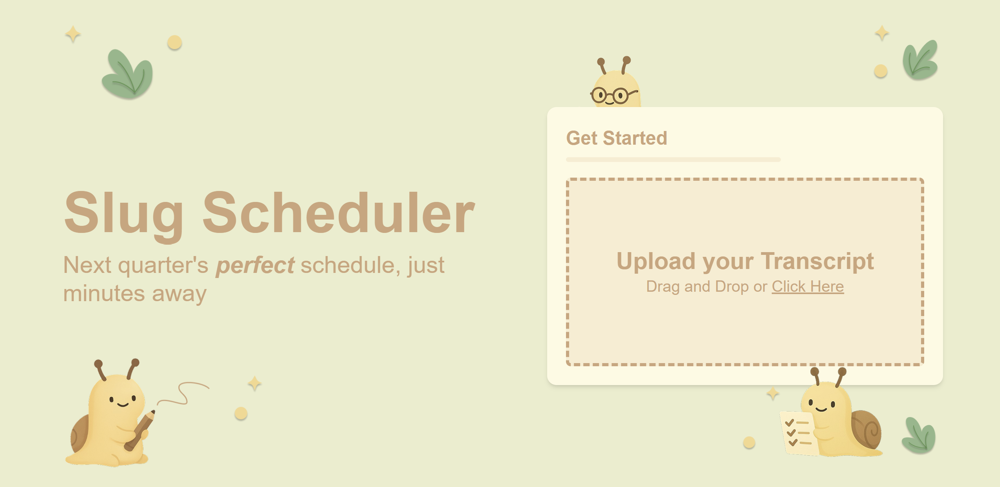
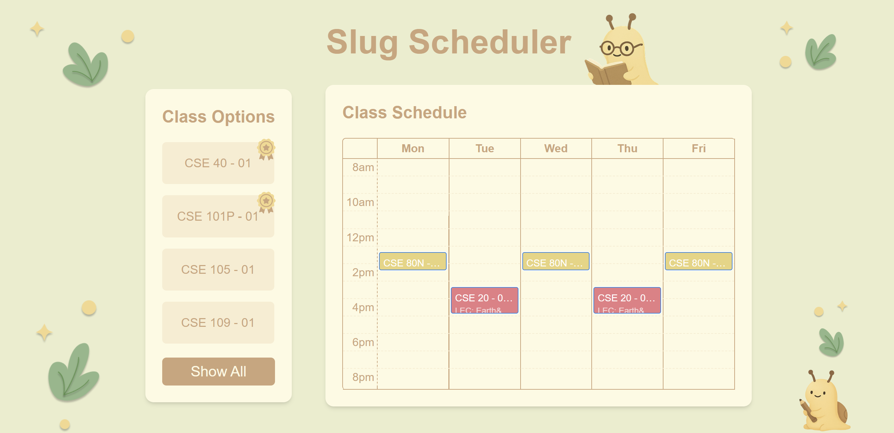

# Slug Scheduler

A smart scheduling assistant for UC Santa Cruz students that creates recommended class schedules in minutes. Upload your transcript to analyze academic progress, generate schedules based on major requirements, and visualize your courses in an interactive calendar interface!

## 🎯 Features

- **PDF Transcript Analysis**: Upload your academic transcript to automatically analyze your academic progress
- **Smart Schedule Generation**: Creates optimized class schedules based on your major requirements
- **Interactive Calendar**: Visualize and modify your class schedule with an intuitive drag-and-drop interface
- **Major Requirements Integration**: Automatically checks degree requirements against UCSC's course catalog
- **Web Scraping**: Pulls real-time course data from UCSC's class search

## 📸 Screenshots


_Friendly landing page for users to upload their university transcript_


_Calendar view with course recommendations for easy scheduling_

## 🚀 Tech Stack

- **Framework**: [Next.js 15.3.0](https://nextjs.org/)
- **UI Components**:
  - [DND Kit](https://dndkit.com/) for drag-and-drop functionality
  - [Tailwind CSS](https://tailwindcss.com/) for styling
- **AI Integration**: Google's [Gemini AI API](https://ai.google.dev/) for transcript analysis
- **PDF Processing**: [PDF.js](https://mozilla.github.io/pdf.js/) for transcript parsing

## 🛠️ Installation

1. Clone the repository:

```bash
git clone https://github.com/charlesphu/slugscheduler.git
```

2. Install dependencies:

```bash
npm install
```

3. Create a `.env.local` file and add your Gemini API key:

```bash
GEMINI_API_KEY="your-api-key"
```

4. Start the development server:

```bash
npm run dev
```

5. Open [http://localhost:3000](http://localhost:3000) in your browser

## 💻 Development

- `npm run dev`: Starts development server with Turbopack
- `npm run build`: Creates production build

## 🤝 Contributing

Contributions are welcome! Please feel free to submit a Pull Request.

## 🙏 Acknowledgments

### The Team:

- **Andy Kuang** - Frontend & UX Design
- **Charles Phu** - Backend & Webscraper
- **Ashwin Vinod** - Backend & Gemini
- **Alaaddin Ghosheh** - Backend & Gemini

Special thanks to the CruzHacks 2025 organizing team for hosting an amazing hackathon that made this project possible
